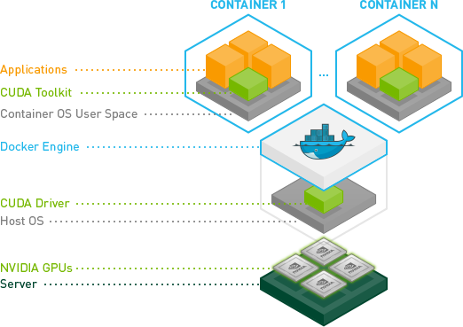

# my-local-ai-env
Descriptions of the hardware and software I have setup at my home office for running open-source, local-first, portable, multi-agent AI workflows.

I am building an AI agent/app to help people develop a career strategy and apply for jobs. The app doesn’t need an internet connection, so I want to focus on local desktop apps for Mac, Windows, and Linux. I will likely use Rust and TypeScript for languages. I want to keep focused on local-first stacks, so I won’t be deploying this to multi-tier cloud environments, which lets me keep it hella simple and private/secure. 

## Hardware
### Alienware Aurora 16
https://www.dell.com/en-us/shop/desktop-computers/alienware-aurora-r16-gaming-desktop/spd/alienware-aurora-r16-desktop

https://www.nvidia.com/en-us/geforce/graphics-cards/40-series/rtx-4090/

https://www.intel.com/content/www/us/en/products/details/processors/core/i9.html

## Software
I’m obsessed with open source, self-hosted, local first, multi-agent workflows. This starter kit is how I’ll prototype my next project: https://github.com/n8n-io/self-hosted-ai-starter-kit. I want to build open AI agents to help people find work and balance out all the corporate AI recruiting automation. The tech stack is centered around libraries like Ollama, LangChain, n8n, and Neo4j.

I’m focused on getting people off big tech cloud providers for benefits related to cost, privacy, security, intellectual property, control, and simplicity. The only hosting providers I plan on using are highly principled companies like Hugging Face, Mistral, Together.ai, and http://Storj.io when local computing or storage doesn’t fit the use case.

### Software Infrastructure
https://ubuntu.com/desktop/wsl

https://learn.microsoft.com/en-us/windows/wsl/install

Docker: This is your containerization platform that packages all AI components into manageable, isolated environments. It will help us run all the AI tools with a single command. https://www.docker.com/products/docker-desktop/

https://docs.docker.com/desktop/features/wsl/

https://git-scm.com/downloads/win

FastAPI

### Data Infrastructure
https://neo4j.com/download/neo4j-desktop

https://neo4j.com/labs/genai-ecosystem/llm-graph-builder/

Postgres: This tool stores all data and logs, acting as a memory buffer for the n8n framework.

Qdrant: A vector database and search engine that makes AI-generated content searchable and manageable.

Storj for object storage and backup. http://storj.io/

### AI Infrastructure
NVIDIA CUDA toolkit for WSL 2 on Ubuntu

Ollama: An AI model manager that enables you to run any open-source large language model locally with minimal hardware requirements. https://ollama.com/

https://www.nvidia.com/en-gb/deep-learning-ai/solutions/data-science/

https://github.com/NVIDIA/data-science-stack

LangChain for orchestration

n8n: A workflow automation framework that allows you to build AI workflows using a drag-and-drop interface. It requires no coding knowledge, making it ideal for non-technical individuals. https://n8n.io/integrations/

### Machine Learning Models
Mistral AI and NVIDIA Unveil Mistral NeMo 12B, a Cutting-Edge Enterprise AI Model: Designed to fit on the memory of a single NVIDIA L40S, NVIDIA GeForce RTX 4090 or NVIDIA RTX 4500 GPU, the Mistral NeMo NIM offers high efficiency, low compute cost, and enhanced security and privacy. https://blogs.nvidia.com/blog/mistral-nvidia-ai-model/

https://huggingface.co/docs/transformers/installation

PyTorch installation instructions.

TensorFlow 2.0 installation instructions.

Flax installation instructions.

https://huggingface.co/NousResearch/Hermes-3-Llama-3.2-3B

mixtral 8x7B

Mistral 7B

### AI Playgrounds
https://github.com/n8n-io/self-hosted-ai-starter-kit

https://neo4j.com/developer-blog/langchain-neo4j-starter-kit/

### Conversational User Interfaces
https://lmstudio.ai/

https://openwebui.com/

### Front-End Development
https://v2.tauri.app/

https://v2.tauri.app/start/frontend/sveltekit/

## Documentation
### Technical Docs
https://documentation.ubuntu.com/wsl/en/latest/

https://docs.n8n.io/hosting/architecture/overview/

### Tutorials
https://documentation.ubuntu.com/wsl/en/latest/tutorials/gpu-cuda/

https://documentation.ubuntu.com/wsl/en/latest/tutorials/data-science-and-engineering/

https://medium.com/@Tanzim/how-to-run-ollama-in-windows-via-wsl-8ace765cee12

https://blogs.nvidia.com/blog/ai-decoded-lm-studio/

https://www.datacamp.com/tutorial/local-ai

https://developer.mozilla.org/en-US/docs/Learn_web_development/Core/Frameworks_libraries/Svelte_getting_started

https://electric-sql.com/blog/2024/02/05/local-first-ai-with-tauri-postgres-pgvector-llama

https://neo4j.com/blog/graphrag-manifesto/

https://neo4j.com/developer/genai-ecosystem/ai-for-customer-experiences/

https://www.reddit.com/r/ollama/comments/1cpo6nb/lan_configuration_for_open_webui/

### Troubleshooting
https://www.pdq.com/blog/what-is-the-powershell-equivalent-of-ipconfig/

## Install Log
### In Windows PowerShell Terminal
Developers can access the power of both Windows and Linux at the same time on a Windows machine. The Windows Subsystem for Linux (WSL) lets developers install a Linux distribution (such as Ubuntu, OpenSUSE, Kali, Debian, Arch Linux, etc) and use Linux applications, utilities, and Bash command-line tools directly on Windows, unmodified, without the overhead of a traditional virtual machine or dualboot setup.

https://learn.microsoft.com/en-us/windows/wsl/install

If you wish to utilize Open WebUI with Ollama included or CUDA acceleration, we recommend utilizing our official images tagged with either :cuda or :ollama. To enable CUDA, you must install the Nvidia CUDA container toolkit on your Linux/WSL system.

https://docs.nvidia.com/dgx/nvidia-container-runtime-upgrade/

    Linux applications can run as is in WSL 2. WSL 2 is characteristically a VM with a Linux WSL Kernel in it that provides full compatibility with mainstream Linux kernel allowing support for native Linux applications including popular Linux distros.
    Faster file system support and that’s more performant.
    WSL 2 is tightly integrated with the Microsoft Windows operating system, which allows it to run Linux applications alongside and even interop with other Windows desktop and modern store apps.
    
With NVIDIA CUDA support for WSL 2, developers can leverage NVIDIA GPU accelerated computing technology for data science, machine learning and inference on Windows through WSL. GPU acceleration also serves to bring down the performance overhead of running an application inside a WSL like environment close to near-native by being able to pipeline more parallel work on the GPU with less CPU intervention.


https://docs.nvidia.com/cuda/wsl-user-guide/index.html

For example, when storing your WSL project files:

    Use the Linux file system root directory: \\wsl$\<DistroName>\home\<UserName>\Project
    Not the Windows file system root directory: C:\Users\<UserName>\Project or /mnt/c/Users/<UserName>/Project$


The NVIDIA Container Toolkit allows users to build and run GPU accelerated Docker containers. The toolkit includes a container runtime library and utilities to configure containers to leverage NVIDIA GPUs automatically. Complete documentation and frequently asked questions are available on the repository wiki.

https://docs.nvidia.com/ai-enterprise/deployment/vmware/latest/docker.html

The latest NVIDIA Windows GPU Driver will fully support WSL 2. With CUDA support in the driver, existing applications (compiled elsewhere on a Linux system for the same target GPU) can run unmodified within the WSL environment.

```
PS C:\Users\paulp> git update-git-for-windows
Git for Windows 2.48.1.windows.1 (64-bit)
Update 2.49.0.windows.1 is available
Download and install Git for Windows v2.49.0.windows.1 [N/y]? y
################################################################################################################ 100.0%
PS C:\Users\paulp>
```
https://learn.microsoft.com/en-us/windows/wsl/tutorials/wsl-git

### In Ubuntu WSL2 Terminal

To compile new CUDA applications, a CUDA Toolkit for Linux x86 is needed. CUDA Toolkit support for WSL is still in preview stage as developer tools such as profilers are not available yet. However, CUDA application development is fully supported in the WSL2 environment, as a result, users should be able to compile new CUDA Linux applications with the latest CUDA Toolkit for x86 Linux.

Option 1: Installation of Linux x86 CUDA Toolkit using WSL-Ubuntu Package - Recommended

The CUDA WSL-Ubuntu local installer does not contain the NVIDIA Linux GPU driver, so by following the steps on the CUDA download page for WSL-Ubuntu, you will be able to get just the CUDA toolkit installed on WSL.

```
wget https://developer.download.nvidia.com/compute/cuda/repos/wsl-ubuntu/x86_64/cuda-wsl-ubuntu.pin
sudo mv cuda-wsl-ubuntu.pin /etc/apt/preferences.d/cuda-repository-pin-600
wget https://developer.download.nvidia.com/compute/cuda/12.8.1/local_installers/cuda-repo-wsl-ubuntu-12-8-local_12.8.1-1_amd64.deb
sudo dpkg -i cuda-repo-wsl-ubuntu-12-8-local_12.8.1-1_amd64.deb
sudo cp /var/cuda-repo-wsl-ubuntu-12-8-local/cuda-*-keyring.gpg /usr/share/keyrings/
sudo apt-get update
sudo apt-get -y install cuda-toolkit-12-8
```

https://developer.nvidia.com/cuda-downloads?target_os=Linux&target_arch=x86_64&Distribution=WSL-Ubuntu&target_version=2.0&target_type=deb_local

Install using the apt repository

Before you install Docker Engine for the first time on a new host machine, you need to set up the Docker apt repository. Afterward, you can install and update Docker from the repository.

    Set up Docker's apt repository.
```

# Add Docker's official GPG key:
sudo apt-get update
sudo apt-get install ca-certificates curl
sudo install -m 0755 -d /etc/apt/keyrings
sudo curl -fsSL https://download.docker.com/linux/ubuntu/gpg -o /etc/apt/keyrings/docker.asc
sudo chmod a+r /etc/apt/keyrings/docker.asc

# Add the repository to Apt sources:
echo \
  "deb [arch=$(dpkg --print-architecture) signed-by=/etc/apt/keyrings/docker.asc] https://download.docker.com/linux/ubuntu \
  $(. /etc/os-release && echo "${UBUNTU_CODENAME:-$VERSION_CODENAME}") stable" | \
  sudo tee /etc/apt/sources.list.d/docker.list > /dev/null
sudo apt-get update
```
Install the Docker packages. To install the latest version, run:
```
sudo apt-get install docker-ce docker-ce-cli containerd.io docker-buildx-plugin docker-compose-plugin
```

Configure the production repository:
```
curl -fsSL https://nvidia.github.io/libnvidia-container/gpgkey | sudo gpg --dearmor -o /usr/share/keyrings/nvidia-container-toolkit-keyring.gpg \
  && curl -s -L https://nvidia.github.io/libnvidia-container/stable/deb/nvidia-container-toolkit.list | \
    sed 's#deb https://#deb [signed-by=/usr/share/keyrings/nvidia-container-toolkit-keyring.gpg] https://#g' | \
    sudo tee /etc/apt/sources.list.d/nvidia-container-toolkit.list
```


Update the packages list from the repository:
```
sudo apt-get update
```

Install the NVIDIA Container Toolkit packages:
```
sudo apt-get install -y nvidia-container-toolkit
```

Prerequisites

    You installed a supported container engine (Docker, Containerd, CRI-O, Podman).

    You installed the NVIDIA Container Toolkit.

Configuring Docker

Configure the container runtime by using the nvidia-ctk command:
```
sudo nvidia-ctk runtime configure --runtime=docker
```

The nvidia-ctk command modifies the /etc/docker/daemon.json file on the host. The file is updated so that Docker can use the NVIDIA Container Runtime.

Restart the Docker daemon:
```
sudo systemctl restart docker
```

https://docs.nvidia.com/datacenter/cloud-native/container-toolkit/latest/install-guide.html#installing-the-nvidia-container-toolkit

After you install and configure the toolkit and install an NVIDIA GPU Driver, you can verify your installation by running a sample workload.

    Run a sample CUDA container:
```
praeducer@prAIserver:~$ sudo docker run --rm --runtime=nvidia --gpus all ubuntu nvidia-smi
[sudo] password for praeducer:
Unable to find image 'ubuntu:latest' locally
latest: Pulling from library/ubuntu
5a7813e071bf: Pull complete
Digest: sha256:72297848456d5d37d1262630108ab308d3e9ec7ed1c3286a32fe09856619a782
Status: Downloaded newer image for ubuntu:latest
Tue Apr  8 15:16:36 2025
+-----------------------------------------------------------------------------------------+
| NVIDIA-SMI 565.75                 Driver Version: 566.24         CUDA Version: 12.7     |
|-----------------------------------------+------------------------+----------------------+
| GPU  Name                 Persistence-M | Bus-Id          Disp.A | Volatile Uncorr. ECC |
| Fan  Temp   Perf          Pwr:Usage/Cap |           Memory-Usage | GPU-Util  Compute M. |
|                                         |                        |               MIG M. |
|=========================================+========================+======================|
|   0  NVIDIA GeForce RTX 4090        On  |   00000000:01:00.0  On |                  Off |
|  0%   36C    P8             12W /  450W |    3149MiB /  24564MiB |      5%      Default |
|                                         |                        |                  N/A |
+-----------------------------------------+------------------------+----------------------+

+-----------------------------------------------------------------------------------------+
| Processes:                                                                              |
|  GPU   GI   CI        PID   Type   Process name                              GPU Memory |
|        ID   ID                                                               Usage      |
|=========================================================================================|
|  No running processes found                                                             |
+-----------------------------------------------------------------------------------------+
```

CDI is an open specification for container runtimes that abstracts what access to a device, such as an NVIDIA GPU, means, and standardizes access across container runtimes. Popular container runtimes can read and process the specification to ensure that a device is available in a container. CDI simplifies adding support for devices such as NVIDIA GPUs because the specification is applicable to all container runtimes that support CDI.

CDI also improves the compatibility of the NVIDIA container stack with certain features such as rootless containers.

Generate the CDI specification file:
```
praeducer@prAIserver:~$ sudo nvidia-ctk cdi generate --output=/etc/cdi/nvidia.yaml
INFO[0000] Using /usr/lib/wsl/lib/libnvidia-ml.so.1
INFO[0000] Auto-detected mode as 'wsl'
INFO[0000] Selecting /dev/dxg as /dev/dxg
INFO[0000] Using WSL driver store paths: [/usr/lib/wsl/drivers/nvdd.inf_amd64_0759f801dbae033f]
INFO[0000] Selecting /usr/lib/wsl/drivers/nvdd.inf_amd64_0759f801dbae033f/libcuda.so.1.1 as /usr/lib/wsl/drivers/nvdd.inf_amd64_0759f801dbae033f/libcuda.so.1.1
INFO[0000] Selecting /usr/lib/wsl/drivers/nvdd.inf_amd64_0759f801dbae033f/libcuda_loader.so as /usr/lib/wsl/drivers/nvdd.inf_amd64_0759f801dbae033f/libcuda_loader.so
INFO[0000] Selecting /usr/lib/wsl/drivers/nvdd.inf_amd64_0759f801dbae033f/libnvidia-ptxjitcompiler.so.1 as /usr/lib/wsl/drivers/nvdd.inf_amd64_0759f801dbae033f/libnvidia-ptxjitcompiler.so.1
INFO[0000] Selecting /usr/lib/wsl/drivers/nvdd.inf_amd64_0759f801dbae033f/libnvidia-ml.so.1 as /usr/lib/wsl/drivers/nvdd.inf_amd64_0759f801dbae033f/libnvidia-ml.so.1
INFO[0000] Selecting /usr/lib/wsl/drivers/nvdd.inf_amd64_0759f801dbae033f/libnvidia-ml_loader.so as /usr/lib/wsl/drivers/nvdd.inf_amd64_0759f801dbae033f/libnvidia-ml_loader.so
INFO[0000] Selecting /usr/lib/wsl/lib/libdxcore.so as /usr/lib/wsl/lib/libdxcore.so
INFO[0000] Selecting /usr/lib/wsl/drivers/nvdd.inf_amd64_0759f801dbae033f/libnvdxgdmal.so.1 as /usr/lib/wsl/drivers/nvdd.inf_amd64_0759f801dbae033f/libnvdxgdmal.so.1
INFO[0000] Selecting /usr/lib/wsl/drivers/nvdd.inf_amd64_0759f801dbae033f/nvcubins.bin as /usr/lib/wsl/drivers/nvdd.inf_amd64_0759f801dbae033f/nvcubins.bin
INFO[0000] Selecting /usr/lib/wsl/drivers/nvdd.inf_amd64_0759f801dbae033f/nvidia-smi as /usr/lib/wsl/drivers/nvdd.inf_amd64_0759f801dbae033f/nvidia-smi
INFO[0000] Generated CDI spec with version 0.8.0

praeducer@prAIserver:~$ nvidia-ctk cdi list
INFO[0000] Found 1 CDI devices
nvidia.com/gpu=all
```
https://docs.nvidia.com/datacenter/cloud-native/container-toolkit/latest/cdi-support.html

After you install and configura the toolkit (including generating a CDI specification) and install an NVIDIA GPU Driver, you can verify your installation by running a sample workload.
```
praeducer@prAIserver:~$ sudo apt install podman

praeducer@prAIserver:~$ podman run --rm --security-opt=label=disable    --device=nvidia.com/gpu=all    ubuntu nvidia-smi
Tue Apr  8 15:27:58 2025
+-----------------------------------------------------------------------------------------+
| NVIDIA-SMI 565.75                 Driver Version: 566.24         CUDA Version: 12.7     |
|-----------------------------------------+------------------------+----------------------+
| GPU  Name                 Persistence-M | Bus-Id          Disp.A | Volatile Uncorr. ECC |
| Fan  Temp   Perf          Pwr:Usage/Cap |           Memory-Usage | GPU-Util  Compute M. |
|                                         |                        |               MIG M. |
|=========================================+========================+======================|
|   0  NVIDIA GeForce RTX 4090        On  |   00000000:01:00.0  On |                  Off |
|  0%   38C    P8             12W /  450W |    3216MiB /  24564MiB |      8%      Default |
|                                         |                        |                  N/A |
+-----------------------------------------+------------------------+----------------------+

+-----------------------------------------------------------------------------------------+
| Processes:                                                                              |
|  GPU   GI   CI        PID   Type   Process name                              GPU Memory |
|        ID   ID                                                               Usage      |
|=========================================================================================|
|  No running processes found                                                             |
+-----------------------------------------------------------------------------------------+
```

Follow this step-by-step guide to Get started using Visual Studio Code with WSL, which includes installing the Remote Development extension pack. This extension enables you to run WSL, SSH, or a development container for editing and debugging with the full set of Visual Studio Code features. Quickly swap between different, separate development environments and make updates without worrying about impacting your local machine.

https://learn.microsoft.com/en-us/windows/wsl/tutorials/wsl-vscode

The Remote Development extension pack allows you to open any folder in a container, on a remote machine, or in the Windows Subsystem for Linux (WSL) and take advantage of VS Code's full feature set. Since this lets you set up a full-time development environment anywhere, you can:

    Develop on the same operating system you deploy to or use larger, faster, or more specialized hardware than your local machine.
    Quickly swap between different, separate development environments and make updates without worrying about impacting your local machine.
    Help new team members / contributors get productive quickly with easily spun up, consistent development containers.
    Take advantage of a Linux based tool-chain right from the comfort of Windows from a full-featured development tool.

No source code needs to be on your local machine to gain these benefits since Remote Development runs commands and extensions directly on the remote machine.

This Remote Development extension pack includes four extensions:

    Remote - SSH - Work with source code in any location by opening folders on a remote machine/VM using SSH. Supports x86_64, ARMv7l (AArch32), and ARMv8l (AArch64) glibc-based Linux, Windows 10/Server (1803+), and macOS 10.14+ (Mojave) SSH hosts.
    Remote - Tunnels - Work with source code in any location by opening folders on a remote machine/VM using a VS Code Tunnel (rather than SSH).
    Dev Containers - Work with a separate toolchain or container based application by opening any folder mounted into or inside a container.
    WSL - Get a Linux-powered development experience from the comfort of Windows by opening any folder in the Windows Subsystem for Linux.

https://marketplace.visualstudio.com/items?itemName=ms-vscode-remote.vscode-remote-extensionpack

To add wget (to retrieve content from web servers) and ca-certificates (to allow SSL-based applications to check for the authenticity of SSL connections), enter:
Bash
```
sudo apt-get install wget ca-certificates
```

Once VS Code is installed and set up, you can open your WSL project with a VS Code remote server by entering: code .
```
praeducer@prAIserver:~$ code .
Installing VS Code Server for Linux x64 (4437686ffebaf200fa4a6e6e67f735f3edf24ada)
Downloading: 100%
Unpacking: 100%
Unpacked 2067 files and folders to /home/praeducer/.vscode-server/bin/4437686ffebaf200fa4a6e6e67f735f3edf24ada.
Looking for compatibility check script at /home/praeducer/.vscode-server/bin/4437686ffebaf200fa4a6e6e67f735f3edf24ada/bin/helpers/check-requirements.sh
Running compatibility check script
Compatibility check successful (0)
```

Remote - SSH: Install an OpenSSH compatible SSH client.
```
sudo apt-get install openssh-client
sudo apt-get install openssh-server
```
https://code.visualstudio.com/docs/remote/troubleshooting#_installing-a-supported-ssh-client

To get started developing apps using Docker with WSL 2, we recommend using VS Code, along with the WSL, Dev Containers, and Docker extensions.

    Install the VS Code WSL extension. This extension enables you to open your Linux project running on WSL in VS Code (no need to worry about pathing issues, binary compatibility, or other cross-OS challenges). https://marketplace.visualstudio.com/items?itemName=ms-vscode-remote.remote-wsl

    Install the VS Code Dev Containers extension. This extension enables you to open your project folder or repo inside of a container, taking advantage of Visual Studio Code's full feature set to do your development work within the container. https://marketplace.visualstudio.com/items?itemName=ms-vscode-remote.remote-containers

    Install the VS Code Docker extension. This extension adds the functionality to build, manage, and deploy containerized applications from inside VS Code. (You need the Dev Containers extension to actually use the container as your dev environment.) https://marketplace.visualstudio.com/items?itemName=ms-azuretools.vscode-docker

https://learn.microsoft.com/en-us/windows/wsl/tutorials/wsl-containers

Quick start: Open an existing folder in a container

This quick start covers how to set up a dev container for an existing project to use as your full-time development environment using existing source code on your filesystem.
https://code.visualstudio.com/docs/devcontainers/containers#_quick-start-open-an-existing-folder-in-a-container 

Follow this step-by-step guide to Get started using Git on WSL and connect your project to the Git version control system, along with using the credential manager for authentication, using Git Ignore files, understanding Git line endings, and using the Git commands built-in to VS Code.


For the latest stable Git version in Ubuntu/Debian, enter the command:
```
sudo apt-get install git
```

https://learn.microsoft.com/en-us/windows/wsl/tutorials/wsl-git

Follow this step-by-step guide to Get started with Docker remote containers on WSL 2 and connect your project to a remote development container with Docker Desktop for Windows.

https://learn.microsoft.com/en-us/windows/wsl/tutorials/wsl-containers

Follow this step-by-step guide to set up GPU accelerated machine learning training in WSL and leverage your computer's GPU (graphics processing unit) to accelerate performance heavy workloads.

https://learn.microsoft.com/en-us/windows/wsl/tutorials/gpu-compute

```
git clone https://github.com/NVIDIA/data-science-stack
cd data-science-stack
./data-science-stack setup-system
```


To get up and running with large language models:
```
curl -fsSL https://ollama.com/install.sh | sh
```
Or
```
curl https://ollama.ai/install.sh | sh
ollama run mistral-nemo
```

https://github.com/ollama/ollama

To run Open WebUI with Nvidia GPU support, use this command:
```
docker run -d -p 3000:8080 --gpus all --add-host=host.docker.internal:host-gateway -v open-webui:/app/backend/data --name open-webui --restart always ghcr.io/open-webui/open-webui:cuda
```
https://github.com/open-webui/open-webui


```
C:\Users\paulp> sudo netsh interface portproxy add v4tov4 listenport=8080 listenaddress=0.0.0.0 connectport=8080 connectaddress=192.168.1.254
```
